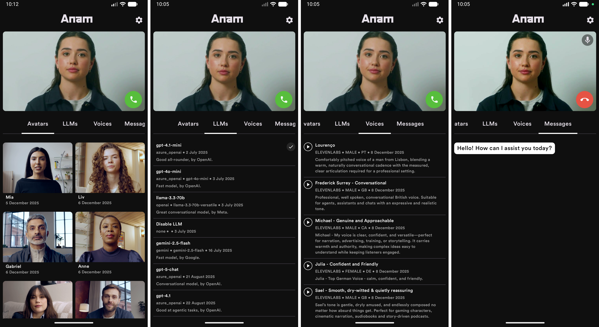

# Anam AI Kotlin Multiplatform SDK

[](https://search.maven.org/search?q=g:ai.anam) 

This is the Anam AI Kotlin Multiplatform SDK. It's an experimental SDK (not official) to integrate Anam's digital personas into your product.



## Introduction

The Anam AI Kotlin Multiplatform SDK is designed to help developers integrate Anam AI's digital personas into their Kotlin Multiplatform applications. The SDK provides a set of APIs and utilities to make it easier to create, manage, and interact with digital personas in a realtime environment.

The project includes an example Multiplatform application that targets Android, iOS, and Web (wasmJs), built with Compose Multiplatform.

**⚠️ Experimental Disclaimer**: This SDK is experimental and intended for demonstration purposes. While we allow people to use this code in production, they do so at their own risk. We welcome and accept PRs for any bugs or improvements.

## Installation

The SDK is available on [Maven Central](https://search.maven.org/search?q=g:ai.anam).

### Kotlin Multiplatform

Add the dependency to your `build.gradle.kts`:

```kotlin
kotlin {
    sourceSets {
        commonMain.dependencies {
            implementation("ai.anam:anam-kotlin-sdk:<version>")
        }
    }
}
```

### Android-only (Groovy)

```groovy
dependencies {
    implementation "ai.anam:anam-kotlin-sdk-android:<version>"
}
```

### Version Catalog

```toml
[libraries]
anam-sdk = { module = "ai.anam:anam-kotlin-sdk", version = "<version>" }
```

## Requirements

### macOS Dependencies

#### Quick Setup (Recommended)

Install all Homebrew dependencies at once using the included `Brewfile`:

```bash
brew bundle
```

This will install:
- `openjdk@21` (Java Development Kit required for Gradle)
- `kotlin` (Kotlin compiler)
- `swiftlint` (Swift code linter for iOS)
- `cocoapods` (iOS dependency manager)

#### Manual Setup

If you prefer to install dependencies manually:

```bash
# Java Development Kit (required for Gradle)
brew install openjdk@21

# Kotlin compiler (optional but recommended)
brew install kotlin

# SwiftLint (optional, for iOS code quality)
brew install swiftlint

# CocoaPods (required for iOS dependencies)
brew install cocoapods
```

**Additional Setup:**
- **Xcode Command Line Tools** (required for iOS builds):
  ```bash
  xcode-select --install
  ```
- **Xcode**: Install from the App Store (required for iOS development)
- **Android SDK**: Install via [JetBrains Toolbox](https://www.jetbrains.com/toolbox-app/) (recommended for better version management):
  ```bash
  brew install --cask jetbrains-toolbox
  ```
  Then use Toolbox to install Android Studio. Alternatively, install Android SDK command line tools directly:
  ```bash
  brew install --cask android-commandlinetools
  ```
- **Modern web browser** (for Web/wasmJs): Chrome, Firefox, Safari, or Edge with WebAssembly support.

## Project Structure

```
Anam/
├── apps/
│   ├── android/          # Android application entry point
│   ├── ios/              # iOS application entry point (SwiftUI)
│   └── web/              # Web application entry point (Compose for Web, wasmJs)
│
├── packages/
│   ├── app/              # Shared Compose Multiplatform UI module
│   │
│   ├── core/             # Core functionality modules
│   │   ├── coroutines/   # Coroutines utilities
│   │   ├── di/           # Dependency injection
│   │   ├── logging/      # Logging utilities
│   │   ├── navigation/   # Navigation components
│   │   ├── settings/     # Settings/preferences management
│   │   └── ui/           # UI components
│   │       ├── core/     # Core UI components
│   │       ├── resources/# Resources (fonts, images, etc.)
│   │       └── theme/    # Theme configuration
│   │
│   ├── feature/          # Feature modules
│   │   └── home/         # Home feature
│   │
│   └── sdk/              # SDK module for API clients
│
└── gradle/
    └── build-logic/      # Custom Gradle conventions and plugins
```

## Building

### API Token Setup

In order to run the applications, you are required to:

1. **Generate an API token** via [Anam Labs](https://anam.ai) (or your Anam Labs instance)

2. **Add the API token** to your build configuration. You can do this in one of the following ways:

   **Option A: Add to `gradle.properties`** (recommended for team sharing):
   ```properties
   API_TOKEN=your_api_token_here
   ```

   **Option B: Add to `local.properties`** (recommended for local development, as this file is git-ignored):
   ```properties
   API_TOKEN=your_api_token_here
   ```

   **Option C: Pass via command line**:
   ```bash
   ./gradlew :apps:android:assembleDebug -PAPI_TOKEN=your_api_token_here
   ```

   The build system will check for the token in this order: Gradle properties → `local.properties` → defaults to empty string if not found.

   ⚠️ **Note**: If you don't set the API token, the app will build but may not function correctly without a valid token.

### Android

```bash
# Build debug APK
./gradlew :apps:android:assembleDebug

# Install and run on connected device/emulator
./gradlew :apps:android:installDebug
```

### iOS

**First-time setup:**

1. Install CocoaPods dependencies (required for WebRTC SDK):
   ```bash
   cd apps/ios
   pod install
   ```

   Or use the Gradle task:
   ```bash
   ./gradlew :packages:sdk:podInstall
   ```

2. Configure CocoaPods path (if building from Xcode):

   If you get `ERROR: CocoaPods executable not found in your PATH` when building in Xcode, add the CocoaPods path to `local.properties`:
   ```bash
   echo "kotlin.apple.cocoapods.bin=$(which pod)" >> local.properties
   ```

   Or manually edit `local.properties` and add:
   ```properties
   kotlin.apple.cocoapods.bin=/opt/homebrew/bin/pod
   ```
   (Adjust the path if CocoaPods is installed elsewhere)

3. Open the **workspace** (not the project) in Xcode:
   ```bash
   open apps/ios/App.xcworkspace
   ```

   ⚠️ **Important**: Always open `App.xcworkspace`, not `App.xcodeproj`, when using CocoaPods.

**Building:**

```bash
# Build from command line (requires Xcode)
xcodebuild -workspace apps/ios/App.xcworkspace -scheme App -configuration Debug
```

### Web (wasmJs)

A modern web browser with WebAssembly support is required. No Xcode, CocoaPods, or Android SDK needed.

```bash
# Run development server (opens in browser)
./gradlew :apps:web:wasmJsBrowserDevelopmentRun

# Build production distribution (output in apps/web/build/dist/wasmJs/productionExecutable/)
./gradlew :apps:web:wasmJsBrowserDistribution
```

The API token from [API Token Setup](#api-token-setup) is read from `gradle.properties` or `local.properties` when running the web app.

## Tech Stack

- **Kotlin**: 2.2.21
- **Compose Multiplatform**: 1.10.0
- **Gradle**: 8.14.3
- **Ktor**: 3.3.3 (HTTP client)
